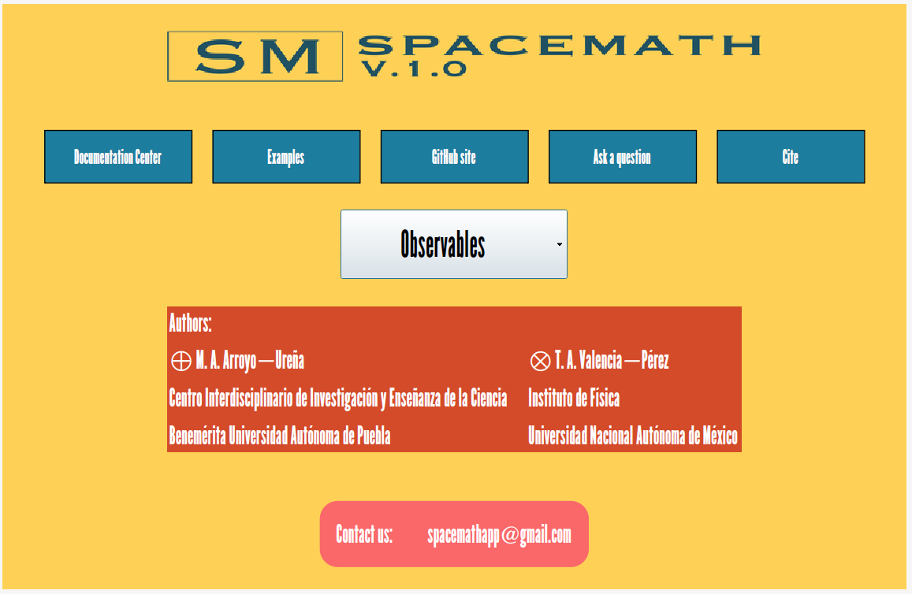

# Working mode

When clicking on the "Observables" button, a window with options is displayed so that the user can work more efficiently.

<figure><figcaption></figcaption></figure>

<figure><figcaption></figcaption></figure>
