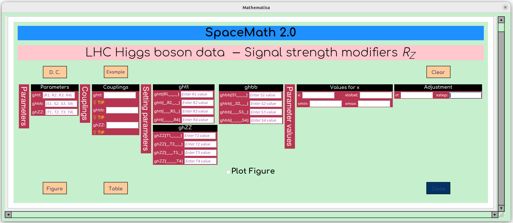
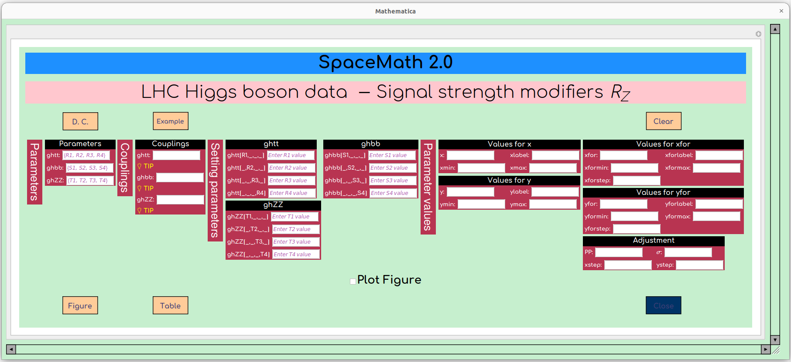

# Friendly mode

When choosing the friendly mode, the following work areas are displayed:

<figure><figcaption>
Rz for 1 parameter.
</figcaption></figure>

<figure><figcaption>
Rz for 4 parameters.
</figcaption></figure>
