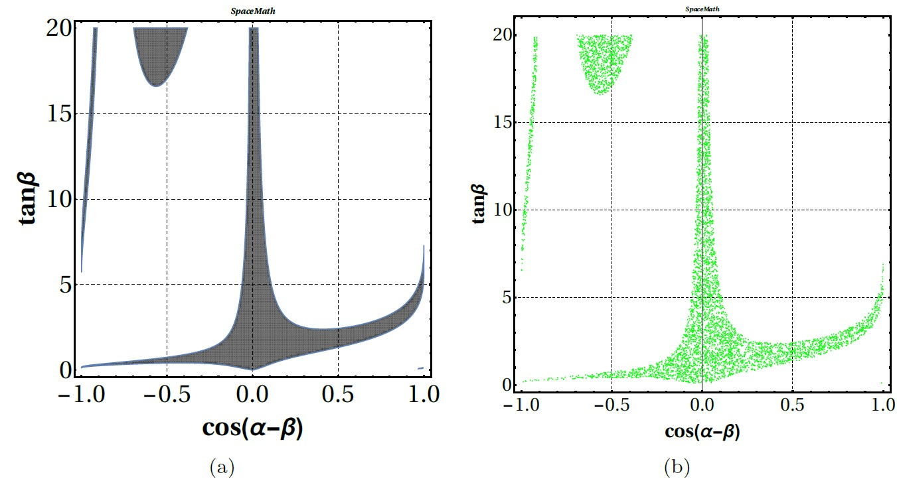
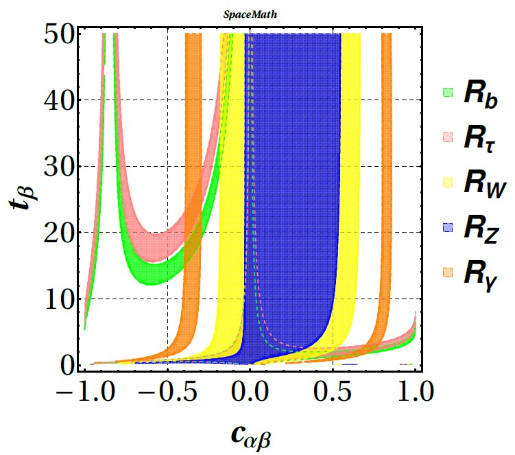
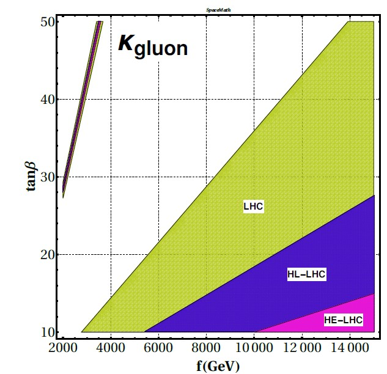

# THDM-III in SpaceMath v1.0

We will show how $$\texttt{SpaceMath v1.0}$$ works for the particular case of $$\mathcal{R}_{\tau}$$ ($$\texttt{Rtau}$$ in the $$\texttt{SpaceMath v1.0}$$ nomenclature).

1. Open a $$\texttt{Mathematica}$$ notebook,
2. Load $$\texttt{SpaceMath v1.0}$$ through $$\texttt{<<SpaceMath`}$$,
3. Define couplings as a function of the free model parameters. For the THDM-III case they are given in Table [#coupling-from-yukawa-lagrangian](thdm-iii-in-spacemath-v1.0.md#coupling-from-yukawa-lagrangian "mention").



$$\texttt{ghtt}=\frac{g}{2}\frac{m_t}{m_W}\left[\frac{\cos\alpha}{\sin\beta}\delta_{ij}-\frac{\sqrt{2}\cos(\alpha-\beta)}{g\sin\beta}\left(\frac{m_{W}}{m_{t}}\right)\left(\tilde{Y}_{2}^{U}\right)_{tt}\right]$$

$$\texttt{ghbb}=  						\frac{g}{2}\frac{m_{b}}{m_W}\left[-\frac{\sin\alpha}{\cos\beta}\delta_{ij}-\frac{\sqrt{2}\cos(\alpha-\beta)}{g\cos\beta}\left(\frac{m_{W}}{m_{b}}\right)\left(\tilde{Y}_{2}^{D}\right)_{bb}\right]$$

$$\texttt{gh}{\tau\tau}=  						\frac{g}{2}\frac{m_{{\tau}}}{m_W}\left[-\frac{\sin\alpha}{\cos\beta}\delta_{ij}-\frac{\sqrt{2}\cos(\alpha-\beta)}{g\cos\beta}\left(\frac{m_{W}}{m_{{\tau}}}\right)\left(\tilde{Y}_{2}^{\ell}\right)_{{\tau\tau}}\right]$$



```wolfram
ghtt[a_,Att_,Cab_,tb_]:=(g/2)(mt/mW)((Cos[a]/tb*Cos[ArcTan[tb]])-(Sqrt[2]*Cab/(g*tb*Cos[ArcTan[tb]])*(mW/mt)*(mt/vev*Att)))	
```

```wolfram
ghbb[a_,Abb_,Cab_,tb_]:=(g/2)(mb/mW)((-Sin[a]*tb/Sin[ArcTan[tb]])+(Sqrt[2]*(Cab*tb)/(g*Sin[ArcTan[tb]])*(mW/mb)*(mb/vev*Abb)))
```

```wolfram
ghtautau[a_,Atata_,Cab_,tb_]:=(g/2)(mtau/mW)((-Sin[a]*tb/Sin[ArcTan[tb]])+(Sqrt[2]*(Cab*tb)/(g*Sin[ArcTan[tb]])*(mW/mtau)*(mtau/vev*Atata)))	
```



We define $$\texttt{a}$$=$$\alpha$$, $$\texttt{Cab}$$=$$\cos(\alpha-\beta)$$, $$\texttt{sab}$$=$$\sin(\alpha-\beta)$$, $$\texttt{tb}$$=$$\tan\beta$$, $$\left(\tilde{Y}{2}^{F}\right){ij}=\sqrt{m_im_j}A_{ij}/\upsilon$$ and $$\sin\beta=\tan\beta\cos(\tan^{-1}(\tan\beta))$$. The terms $$\texttt{mf (f= fermions), mV (V=Z, W), g}$$ and $$\texttt{vev}$$ are the fermion masses, gauge boson masses, $$SU(2)$$ coupling constant and the vacuum expectation value, respectively. These quantities are loaded once $$\texttt{SpaceMath v1.0}$$ is executed. The file containing such information is $$\texttt{data.m}$$. From time to time the $$\texttt{data.m}$$ file is updated according to new information from the state of art, so that the user has available this new information simply to run the following instruction:



```mathematica
UpdateSpaceMathData[]
```



4\. To generate a graph of the signal strenght $$\mathcal{R}_{\tau}$$ when it depends on more than one parameter you must execute the command $$\texttt{Rtau[...]}$$ which is described in Table 3, namely:



```mathematica
Rtau[ghtt[ArcCos[cab] + ArcTan[tb], Att, cab, tb],
ghbb[ArcCos[cab] + ArcTan[tb], Abb, cab, tb],
ghtautau[ArcCos[cab] + ArcTan[tb], 1, cab, tb],
cab, tb, -1, 1, 1, 15, "cos(α − β)" , "tan β",
Att, Abb, 0.9, 1, 0.05, 0.9, 1, 0.05, 100][[2]]
```



```mathematica
ghtt=ghtt[ArcCos[cab] + ArcTan[tb], Att, cab, tb],
ghbb=ghbb[ArcCos[cab] + ArcTan[tb], Abb, cab, tb],
ghtautau=ghtautau[ArcCos[cab] + ArcTan[tb], 1, cab, tb],
x=cab, y=tb, xmin=-1, xmax=1, ymin=1, ymax=15,
xlabel=cos(α − β), ylabel=tan β, xfor=Att, yfor=Abb,
xformin=0.9, xformax=1, xforstep=0.05, yforstep=0.05,
PP=100, [[i]]=[[2]](2σ of C.L.)
```



Once the instruction in Eq. 14 was executed, it can take several minutes depending on the resources of your computer equipment. If the message \$$$\texttt{Aborted}$$ appears, don't worry, be patient. On an upgraded computer, it will take a few seconds.

Alternatively, $$\texttt{SpaceMath v1.0}$$ also is able to generate random values as shown in Table 4. The command to do it is the following:

```mathematica
RtauRandom[ghtt_, ghbb_,ghtautau_, x1_, x1min_, x1max_,x2_, x2min_, x2max_, x3_, x3min_, x3max_, x4_, x4min_, x4max_, NN_]
```

This command generates $$\texttt{NN}$$ random values and export it to \$$$\texttt{UserDocumentsDirectory}$$. To graph the generated random values use the following command:

```mathematica
PlotRtauRandom[ci_, cj_, xlabel_, ylabel_]
```

Here, $$\texttt{ci, cj}$$ represent the $$\texttt{i-th}$$ and $$\texttt{j-th}$$ columns to graph in the plane $$\texttt{ci-cj}$$.

Figure 1 shows the graphs generated by $$\texttt{SpaceMath v1.0}$$ using both $$\texttt{Rtau}$$ and $$\texttt{RtauRandom}$$.

<figure><figcaption><p>Fig. 1: Plots generated by <span class="math">\texttt{SpaceMath v1.0}</span> in which the method <span class="math">\texttt{RegionPlot}</span> is shown in (a) and the method <span class="math">\texttt{Random Values}</span> is displayed in (b).</p></figcaption></figure>

We observe that both methods yield the same results, as it should be. In this way, the user can choose the path that suits him best. $$\texttt{SpaceMath v1.0}$$ also generates graphs displaying each of the individual observables; Fig. 2 shows the graph generated by $$\texttt{SpaceMath v1.0}$$.

<figure><figcaption><p>Fig. 2: Plot generated by <span class="math">\texttt{SpaceMath v1.0}</span> displaying each of the individual observables.</p></figcaption></figure>

The command to graph Fig. 2 is the following:

```mathematica
RXALL[ghtt[ArcCos[Cab] + ArcTan[tb], Att, Cab, tb],
ghbb[ArcCos[Cab] + ArcTan[tb], Abb, Cab, tb],
ghZZ[Sqrt[1 - Cab^2]], ghWW[Sqrt[1 - Cab^2]]
ghtautau[ArcCos[Cab] + ArcTan[tb], 1, Cab, tb],
0, mCH, Cab, tb, -1, 1, 0.1, 50,"cos(α − β)",
"tan β", Att, Abb, 0.9, 1, 0.1, 0.9, 1, 0.1, 80][[2]]
```

On the other hand, as far as the $$\kappa_i$$'s are concerned, the procedure is the same as with $$\mathcal{R}_X$$_. As an additional example, we use the_ $$\kappa_i$$ _parameterization, also enabled in_ $$\texttt{SpaceMath v1.0}$$_, to constrain parameters of the_ $$\textit{Simplest Little Higgs Model}$$ _(SLHM). We encourage the reader to consult the Refs. \[42,43] to become familiar with the theoretical framework. Fig. 3 shows the region allowed by_ $$\kappa_{gluon}$$ in the $$\tan\beta-f$$ plane, where $$\tan\beta$$ and $$f$$(GeV) are free SLHM parameters.

<figure><figcaption><p>Fig. 3: Allowed regions by <span class="math">\kappa_{gluon}</span> in the <span class="math">\tan\beta-f</span> plane by considering the measurements reported by LHC and expected results at the HL-LHC and HE-LHC; here <span class="math">\tan\beta</span> and <span class="math">f</span> (GeV) are parameters coming from the SLHM (see Refs. [42,43]). The graph was generated by <span class="math">\texttt{SpaceMath v1.0}</span>.</p></figcaption></figure>

For both $$\kappa_i$$ and $$\mathcal{R}_X$$, we make available to the users the directory $$\texttt{LHC_HiggsBosonData}$$ with examples which they can take as a guide for their own analyzes. This directory can be found in:

\$$$\texttt{SpaceMath/Examples/LHC_HiggsBosonData}$$ or click on the button $$\texttt{"Examples"}$$ once $$\texttt{SpaceMath v1.0}$$ was loaded.


