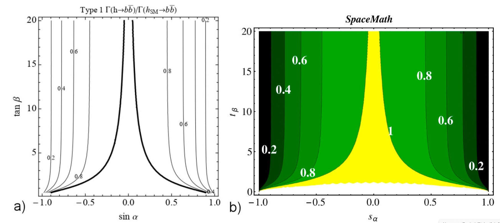
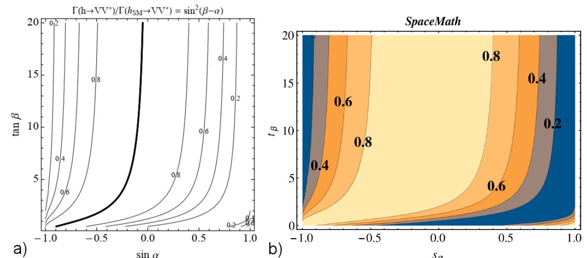
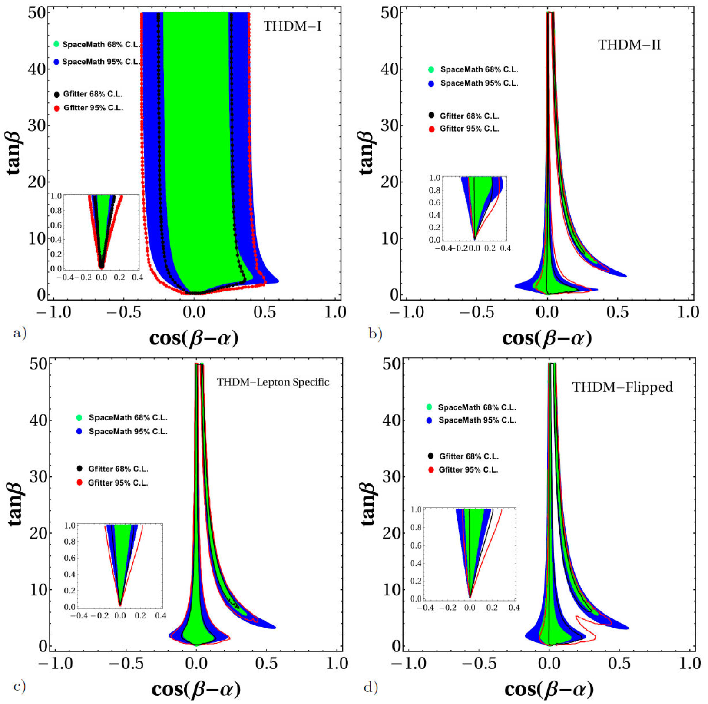
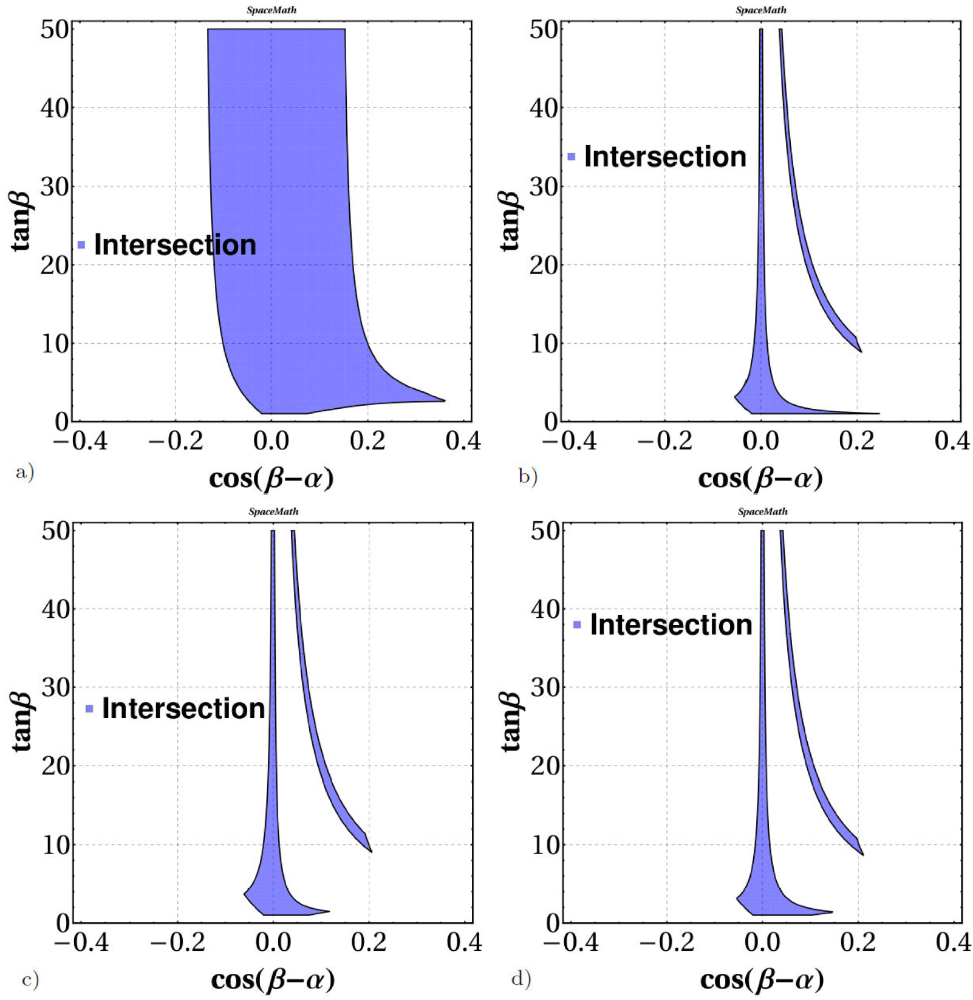

# Validation

In order to validate SpaceMath v1.0, we apply the coupling modifiers $$\kappa_i$$ defined in eq. 3 to the Two-Higgs Doublet Model of Type I and II (THDM-I, II). In Ref. \[[44](references.md)] are reported $$\kappa_b$$ and $$\kappa_V$$ in the context of these models. To reproduce these results via $$\texttt{SpaceMath}$$ v1.0 the only thing we need is to know the model couplings, which are given in Table 9. The commands to evaluate $$\kappa_b$$ and $$\kappa_V$$ are displayed in Table 8.

| Coupling                                                                              | Input to SpaceMath                                                                               |  Command \kappa\_i                                              |
| ------------------------------------------------------------------------------------- | ------------------------------------------------------------------------------------------------ | --------------------------------------------------------------- |
| $$g_{hbb}^{THDM-I}=\frac{gm_{b}}{2m_{W}}\left(\frac{\cos\alpha}{\sin\beta}\right)$$   | $$\texttt{ghbb[Sa\_,Tb\_,Cb\_]:=g*mb*Sqrt[1-Sa\textasciicircum2]/(2*mW*Tb*Cb)}$$                 | $$\texttt{kb[\texttt{ghbb[Sa,Tb,Cos[ArcTan[Tb]]}]]}$$           |
| $$g_{hbb}^{THDM-II}=\frac{gm_{b}}{2m_{W}}\left(\frac{-\sin\alpha}{\cos\beta}\right)$$ | $$\texttt{ghbb[Sa\_,Tb\_,Sb\_]:=-g*mb*Sa*Tb/(2*mW*Sb) }$$                                        | $$\texttt{kb[\texttt{ghbb[Sa,Tb,Sin[ArcTan[Tb]]}]]}$$           |
| $$g_{hVV}^{THDM-I,-II}=g_{V}m_{V}\sin(\beta-\alpha)$$                                 | $$\textrm{ghVV[Tb\_,Cb\_,Sb\_,Sa\_]:=((Tb*Cb*Sqrt[1-Sa\textasciicircum2])-(Sb/Tb*Sa))*(gv*mV)}$$ | $$\texttt{kV[ghVV[Tb, Cos[ArcTan[Tb]], Sin[ArcTan[Tb]], Sa]]}$$ |

Notice that $$\texttt{Sa} \equiv \sin(\alpha)$$, $$\texttt{Tb}\equiv\tan(\beta)$$, $$\texttt{Cb}\equiv\cos(\beta)$$, $$\texttt{Sb}\equiv\sin(\beta)$$ are free parameters of THDM-I, -II and $$V=Z, W$$; users can name them as they like; besides $$\tan\beta=\frac{\sin\beta}{\cos\beta}$$, $$\sin(\beta-\alpha)=\sin\beta\cos\alpha-\cos\beta\sin\alpha$$ has been used. The commands $$\texttt{kb}$$ and $$\texttt{kV}$$ can be directly evaluated by introducing values for $$\texttt{Sa, Tb, Cb}$$, or since $$\texttt{SpaceMath}$$ is hosted in $$\texttt{Mathematica}$$, we can use its commands to graph. For this example we use:

* $$\texttt{ContourPlot[kb[\texttt{ghbb[Sa,Tb,Cos[ArcTan[Tb]]}]]\textasciicircum2,\{Sa,-1,1\},\{Tb,0,20\}]},$$
* $$\texttt{ContourPlot[kV[ghVV[Tb,Cos[ArcTan[Tb]],Sin[ArcTan[Tb]],Sa]]\textasciicircum2,\{Sa,-1,1\},\{Tb,0,20\}]},$$

which generate the graphs displayed in Figs. 4, 5 and 6. The codes that generate these graphs can be found in the $$\texttt{"Examples"}$$ directory, whose path is: $$ $\texttt{SpaceMath/Examples/Validation_RX/SPACEMATH_RX-Validation-THDM.nb} $$ or click on the link $$\texttt{"Examples"}$$ once $$\texttt{SpaceMath}$$ was loaded.

<figure><figcaption><p>Contours of <span class="math">\Gamma(h \to b \bar b) / \Gamma(h_{SM} \to b \bar b)</span> for the SM-like Higgs boson as a function of <span class="math">\sin \alpha</span> and <span class="math">\tan \beta</span> in Type 1 THDM. Left: figure taken from [<a href="references.md">44</a>] and Right: figure generated by <span class="math">\texttt{SpaceMath v1.0}</span>.</p></figcaption></figure>

<figure><figcaption><p>Contours of <span class="math">\Gamma(h \to b \bar b) / \Gamma(h_{SM} \to b \bar b)</span> for the SM-like Higgs boson as a function of <span class="math">\sin \alpha</span> and <span class="math">\tan \beta</span> in Type 2 THDM. Left: figure taken from [<a href="references.md">44</a>] and Right: figure generated by <span class="math">\texttt{SpaceMath v1.0}</span>.</p></figcaption></figure>

<figure><figcaption><p>Contours of <span class="math">\Gamma(h \to VV^{\star}) / \Gamma(h_{SM} VV^{\star})</span> for the SM-like Higgs boson as a function of <span class="math">\sin \alpha</span> and <span class="math">\tan \beta</span> in any of the THDMs. Left: figure taken from [<a href="references.md">44</a>] and Right: figure generated by <span class="math">\texttt{SpaceMath v1.0}</span>.</p></figcaption></figure>

In addition, we also show in Fig. 7 the THDM-I, -II, Lepton Specific and Flipped parameter spaces in the $$\cos(\beta-\alpha)-\tan\beta$$ plane. Again, couplings are shown in Table 9. We compare our results with the ones reported by authors of Ref. \[[45](references.md)]. In these graphs we perform a $$\chi^2$$ test define as follows:

$$
\chi^2=\sum_{i=1}^n\left(\frac{O_i-E_i}{\sigma_i}\right)^2,
$$

where $$O_i$$ and $$E_i$$ are the observed and expected values, respectively, and $$\sigma_i$$ indicates uncertainty. The command for plot these figures is:


{% tab title="95 %" %}
```mathematica
Chi2Rx95[ghtt[-ArcCos[Cab] + ArcTan[tb], tb],ghbb[-ArcCos[Cab] + ArcTan[tb], tb], ghtautau[-ArcCos[Cab] + ArcTan[tb], tb], ghZZ[Sqrt[1 - Cab^2]],ghWW[Sqrt[1 - Cab^2]], 0, 2000, Cab, tb]
```


{% tab title="68 %" %}
```wolfram
Chi2Rx68[ghtt[-ArcCos[Cab] + ArcTan[tb], tb],ghbb[-ArcCos[Cab] + ArcTan[tb], tb], ghtautau[-ArcCos[Cab] + ArcTan[tb], tb],ghZZ[Sqrt[1 - Cab^2]],ghWW[Sqrt[1 - Cab^2]], 0, 2000, Cab, tb]
```



Complete instructions can be found at:  $$ $\texttt{SpaceMath/Examples/Validation_RX/SPACEMATH_RX-Validation-THDM-Chi2Rx.nb} $$

| Coupling              | THDM-I                   | THDM-II                   | THDM-Lepton Specific      | THDM-Flipped              |
| --------------------- | ------------------------ | ------------------------- | ------------------------- | ------------------------- |
| $$hVV$$               | $$\sin(\beta-\alpha)$$   | $$\sin(\beta-\alpha)$$    | $$\sin(\beta-\alpha)$$    | $$\sin(\beta-\alpha)$$    |
| $$hu_{i}u_{i}$$       | $$\cos\alpha/\sin\beta$$ | $$\cos\alpha/\sin\beta$$  | $$\cos\alpha/\sin\beta$$  | $$\cos\alpha/\sin\beta$$  |
| $$hd_{i}d_{i}$$       | $$\cos\alpha/\sin\beta$$ | $$-\sin\alpha/\cos\beta$$ | $$\cos\alpha/\sin\beta$$  | $$-\sin\alpha/\cos\beta$$ |
| $$h\ell_{i}\ell_{i}$$ | $$\cos\alpha/\sin\beta$$ | $$-\sin\alpha/\cos\beta$$ | $$-\sin\alpha/\cos\beta$$ | $$\cos\alpha/\sin\beta$$  |

<figure><figcaption><p>Plane <span class="math">\cos(\beta-\alpha)-\tan\beta</span> for different versions of THDM's: (a) Type I, (b) Type II, (c) Lepton Specific, (d) Flipped. The plots were generated in <span class="math">\texttt{SpaceMath v1.0}</span>.</p></figcaption></figure>

We can observe slight differences between the graphs generated via $$\texttt{SpaceMath v1.0}$$ and those of the $$\texttt{Gfitter}$$ group, this is due to two sources: 1) The experimental data that $$\texttt{SpaceMath}$$ considers are the most recent and 2) the $$\texttt{Gfitter}$$ team includes all production modes of the Higgs boson. Here, it is worth mentioning that even though $$\texttt{SpaceMath v1.0}$$ only has gluon fusion production implemented, our results are highly similar, this may be because it is the dominant channel for the production of the higgs boson.

Besides the $$\chi^2$$ test, $$\texttt{SpaceMath v1.0}$$ also generates the region consistent with all individual observables; Fig. 8 shows the graph generated by $$\texttt{SpaceMath v1.0}$$.

<figure><figcaption><p>Intersection of all channels in the <span class="math">\cos(\beta-\alpha)-\tan\beta</span> plane for different versions of THDM’s: a) Type I, b) Type II, c) Lepton Specific, d) Flipped. The plots were generated in <span class="math">\texttt{SpaceMath v1.0}</span>.</p></figcaption></figure>

Finally, we shown in Table 10 a comparison between our numerical evaluations and those made via $$\texttt{HDecay}$$ package \[23], which the branching ratios of the Higgs boson decaying to pair of particles ($$b\bar{b}$$, $$s\bar{s}$$, $$c\bar{c}$$, $$t\bar{t}$$, $$\tau^+\tau^-$$, $$\mu^+\mu^-$$, $$gg$$, $$\gamma\gamma$$, $$Z\gamma$$, $$W^+W^-$$, $$ZZ$$) in the theoretical framework of the THDM-I are shown. Again, the Feynman rules needed for evaluations are shown in Table 9, where it can be seen that only two parameters are introduced. We take the same inputs for these free THDM-I parameters as in Ref. \[23], namely,

* $$\tan\beta$$= 1.29775,
* $$\alpha$$=-0.684653,

and we also consider a Higgs boson mass of $$m_{h}$$=125.09 GeV.

| $$\mathcal{BR}(h\rightarrow b\bar{b})$$                                                                | $$\mathcal{BR}(h\rightarrow\tau\tau)$$                                                                  | $$\mathcal{BR}(h\rightarrow\mu\mu)$$                                                                    | $$\mathcal{BR}(h\rightarrow s\bar{s})$$                                                                 | $$\mathcal{BR}(h\rightarrow c\bar{c})$$                                                                     | $$\mathcal{BR}(h\rightarrow t\bar{t})$$ |
| ------------------------------------------------------------------------------------------------------ | ------------------------------------------------------------------------------------------------------- | ------------------------------------------------------------------------------------------------------- | ------------------------------------------------------------------------------------------------------- | ----------------------------------------------------------------------------------------------------------- | --------------------------------------- |
| <p>0.6080 </p><p>(<span class="math">\textit{0.6080}</span>)</p>                                       | <p>0.6542 </p><p>(<span class="math">\textit{0.6542}</span>)<span class="math">\times10^{-1}</span></p> | <p>0.2316</p><p>(<span class="math">\textit{0.2316}</span>)<span class="math">\times10^{-3}</span></p>  | <p>0.2294 </p><p>(<span class="math">\textit{0.2294}</span>)<span class="math">\times10^{-3}</span></p> | <p>0.2653</p><p>(<span class="math">\textit{0.2653}</span>)<span class="math">\times10^{-1}</span></p>      | 0 ($$\textit{0}$$)                      |
| $$\mathcal{BR}(h\rightarrow gg)$$                                                                      | $$\mathcal{BR}(h\rightarrow\gamma\gamma)$$                                                              | $$\mathcal{BR}(h\rightarrow Z\gamma)$$                                                                  | $$\mathcal{BR}(h\rightarrow WW)$$                                                                       | $$\mathcal{BR}(h\rightarrow ZZ)$$                                                                           |                                         |
| <p>0.7041</p><p>(<span class="math">\textit{0.7041}</span>)<span class="math">\times10^{-1}</span></p> | <p>0.2126 </p><p>(<span class="math">\textit{0.2126}</span>)<span class="math">\times10^{-2}</span></p> | <p>0.1458 </p><p>(<span class="math">\textit{0.1458}</span>)<span class="math">\times10^{-2}</span></p> | 0.2005 ($$\textit{0.2005}$$)                                                                            | <p>0.2507 </p><p>(<span class="math">\textit{0.2507}</span>)<span class="math">\times10^{-1}</span></p>     |                                         |
| $$\mathcal{BR}(h\rightarrow AA)$$                                                                      | $$\mathcal{BR}(h\rightarrow AZ)$$                                                                       | $$\mathcal{BR}(h\rightarrow W\pm h\mp)$$                                                                | $$\mathcal{BR}(h\rightarrow h+h-)$$                                                                     | $$\Gamma_{h}^{\textrm{tot}}$$                                                                               |                                         |
| $$0 (\textit{0})$$                                                                                     | $$0 (\textit{0})$$                                                                                      | $$0 (\textit{0})$$                                                                                      | $$0 (\textit{0})$$                                                                                      | <p>0.4248 </p><p>(<span class="math">\textit{0.4248}</span>)<span class="math">\times10^{-2}</span> GeV</p> |                                         |

In Table \[10], the quantities in brackets are the results generated via $$\texttt{SpaceMath}$$. We observe that our results are identical to those $$\texttt{HDecay}$$, which is to be expected since we actually reproduced the relevant expressions of the decay widths of the Higgs boson reported in Ref. \[[46](references.md)].

